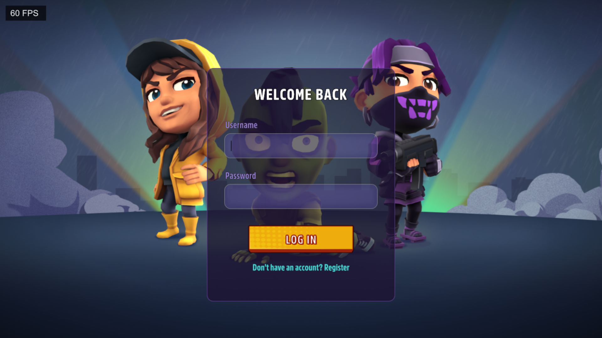
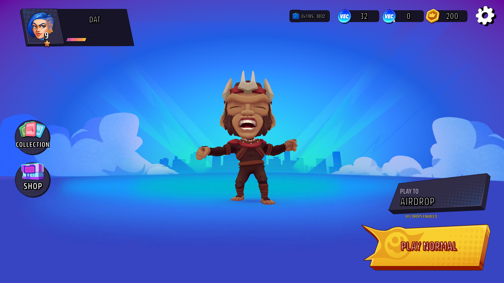
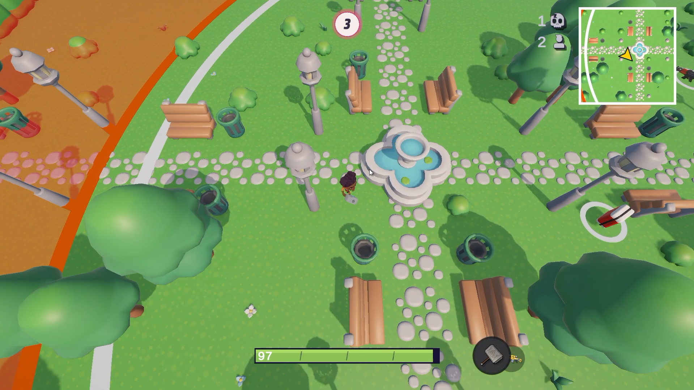

# VectoArena Client

VectoArena Client is the Unity front end for VectoArena, a real-time multiplayer arena game with account progression, collectible VEC rewards, cosmetic skins, and wallet-enabled NFT features. It communicates with the VectoArena server through REST endpoints for account and inventory operations and through Colyseus WebSockets for live matches.

## Game Preview

### Video Demo

[](https://youtu.be/4xNxysfBVFM)
*[Click here to watch the VectoArena Gameplay Video on YouTube](https://youtu.be/4xNxysfBVFM)*

### Authentication Screen



### Main Menu



### Arena Gameplay



## Features

- Account registration and login with token-authenticated player requests.
- Multiplayer battle and Play to Airdrop matchmaking through Colyseus rooms.
- Real-time player movement, ranged and melee combat, item pickups, zone updates, kill feed, and match results.
- Player progression, balance display, transaction history, skin purchases, and skin equipment.
- Wallet linking through signed nonce verification.
- VEC deposits and NFT skin purchase or ownership synchronization.
- UI Toolkit screens for authentication, home, store, settings, gameplay HUD, and death flow.
- Android support with responsive safe-area UI and dual-stick touch controls.

## Technology Stack

| Area | Technology |
| --- | --- |
| Engine | Unity 6, editor version `6000.4.0f1` |
| Rendering | Universal Render Pipeline |
| UI | Unity UI Toolkit and TextMesh Pro |
| Multiplayer | Colyseus Unity SDK |
| Input | Unity Input System |
| Web3 | Thirdweb, Reown AppKit, Nethereum |
| Platforms in project | Android and Standalone; WebGL compatibility code is present but not yet verified |

## Prerequisites

- Unity Hub with Unity Editor `6000.4.0f1` installed.
- Unity Android Build Support, including the Android SDK, NDK, and OpenJDK, when building for mobile.
- A running VectoArena server instance. Local defaults expect `http://localhost:2567` and `ws://localhost:2567`.
- A Thirdweb client ID and blockchain contract configuration when using wallet, deposit, or NFT functionality.
- A compatible wallet for Web3 flows. The current wallet connection flow targets MetaMask through Reown.

## Getting Started

1. Clone or download this repository.
2. Open the `VectoArena` directory as a Unity project in Unity Hub.
3. Allow Unity to resolve packages from `Packages/manifest.json`.
4. Create the local runtime configuration file:

   ```powershell
   Copy-Item Assets/Resources/Config/appsettings.json.example Assets/Resources/Config/appsettings.json
   ```

5. Update `Assets/Resources/Config/appsettings.json` for the server and Web3 environment.
6. Start the VectoArena server.
7. Open `Assets/Scenes/AuthScene.unity` and press Play.

The file `Assets/Resources/Config/appsettings.json` is ignored by Git and should contain environment-specific values only.

## Client Configuration

The game loads configuration from `Assets/Resources/Config/appsettings.json` through `ConfigManager`. When the file is absent, the code falls back to localhost server URLs and empty Web3 values.

| Property | Purpose | Local example |
| --- | --- | --- |
| `serverUrl` | Colyseus WebSocket endpoint | `ws://localhost:2567` |
| `httpUrl` | REST API base URL | `http://localhost:2567` |
| `chainId` | Network for VEC deposit operations | `11155111` |
| `treasuryWalletAddress` | Destination wallet for VEC deposits | Environment-specific address |
| `thirdwebClientId` | Thirdweb application client ID | Environment-specific value |
| `nftChainId` | Chain used for NFT skin operations | `11155111` |
| `vecTokenAddress` | VEC ERC-20 token used for deposits and NFT skin purchases | Environment-specific address |
| `skinNftContractAddress` | NFT skin contract address | Environment-specific address |
| `nftSkinPriceWei` | Default skin price in token base units | `1000000000000000000` |
| `nftSkins` | Client mapping of skin IDs, token IDs, and prices | Array of configured skins |

Do not commit production credentials, private keys, or environment-specific application identifiers.

## Scenes and Game Flow

The build settings contain the following scenes in order:

| Scene | Purpose |
| --- | --- |
| `AuthScene` | Account registration, login, and Web3 initialization entry point |
| `MainScene` | Home screen, wallet connection, store, settings, and matchmaking |
| `GameplayScene` | Networked combat, items, zone, HUD, and match result flow |

After login, the client loads the player profile and inventory from the server. From the main scene, a player joins either the standard `battle` room or the `airdrop` room. Play to Airdrop eligibility is enforced by the server.

## Server Integration

### REST Requests Used by the Client

| Endpoint | Purpose |
| --- | --- |
| `POST /auth/register` | Create an account |
| `POST /auth/login` | Authenticate and receive a bearer token |
| `GET /player/profile` | Load balances, progression, loadout, and skins |
| `GET /player/transactions` | Load currency transaction history |
| `POST /player/buy-skin` | Buy a non-NFT cosmetic skin |
| `POST /player/equip-skin` | Equip an owned player skin |
| `GET /wallet/nonce` | Request a message to sign for wallet linking |
| `POST /wallet/verify` | Submit wallet address, nonce, and signature |
| `POST /web3/deposit` | Verify an on-chain VEC deposit |
| `POST /nft/sync` | Synchronize NFT skin ownership |
| `POST /nft/purchase/confirm` | Confirm an NFT skin purchase transaction |

All routes except registration and login require the bearer token issued by the server.

### Multiplayer Rooms

| Room | Purpose |
| --- | --- |
| `battle` | Standard arena match |
| `airdrop` | Play to Airdrop match with VEC reward rules |

The client sends movement, shooting, hit, melee, weapon-switch, and pickup messages. The server synchronizes authoritative room state and broadcasts match lifecycle, combat, pickup, kill feed, and match result events.

## Building the Client

1. Confirm that the correct configuration values are available in `Assets/Resources/Config/appsettings.json`.
2. Open `File > Build Profiles` in Unity.
3. Select the target platform and ensure the three production scenes remain enabled in build order.
4. Build and run the application.

For deployed clients, replace localhost URLs with reachable HTTP and WebSocket endpoints. Browser builds also require a backend deployment that permits the origin used by the WebGL client.

## Mobile Support

The mobile client currently targets Android. It uses the application ID `com.vectoarena.game`,
IL2CPP with ARM64, landscape-only autorotation, the `Mobile` quality profile, and responsive
safe-area layouts for devices with notches or display cutouts.

### Touch Controls

Gameplay displays two floating touch sticks on mobile:

| Control | Action |
| --- | --- |
| Left stick | Move the player relative to the camera |
| Right stick | Aim; pushing it far enough also fires the equipped ranged weapon |
| Weapon button | Switch between melee and the currently held ranged weapon |

To test the mobile HUD in Play Mode with mouse or pointer input, enable
`VectoArena > Mobile > Simulate Touch Controls` in the Unity Editor.

### Build for Android

The project provides these build commands under `VectoArena > Build`:

| Command | Output | Purpose |
| --- | --- | --- |
| `Android Development APK` | `Build/Android/VectoArena-dev.apk` | Debuggable development build |
| `Android Development APK (Build & Run)` | `Build/Android/VectoArena-dev.apk` | Build and launch on a connected device |
| `Android Release AAB` | `Build/Android/VectoArena-release.aab` | Signed release bundle for distribution |

Release signing is intentionally kept outside source control. Configure these environment
variables before starting Unity or creating the release AAB:

| Variable | Purpose |
| --- | --- |
| `VECTO_ANDROID_KEYSTORE_PATH` | Absolute path to the upload keystore |
| `VECTO_ANDROID_KEYSTORE_PASSWORD` | Keystore password |
| `VECTO_ANDROID_KEY_ALIAS` | Upload key alias |
| `VECTO_ANDROID_KEY_PASSWORD` | Upload key password |

Android devices cannot reach a development server through the computer's `localhost`. Set
`serverUrl` and `httpUrl` in the local runtime configuration to LAN-accessible endpoints for local
testing, or deployed `wss://` and `https://` endpoints for release builds. Wallet callbacks use the
`com.vectoarena.game://` URI scheme declared in the Android manifest.

## Project Structure

| Path | Description |
| --- | --- |
| `Assets/Scenes` | Authentication, menu, and gameplay scenes |
| `Assets/Scripts/Config` | Runtime configuration models and loader |
| `Assets/Scripts/Network` | Colyseus room integration and synchronized schema models |
| `Assets/Scripts/Web3` | Wallet, token deposit, and NFT transaction integration |
| `Assets/Scripts/UI` | UI controllers, inventory, store, HUD, and flow logic |
| `Assets/Resources/Config` | Local configuration example and ignored runtime settings |
| `Assets/Art/UI` | UI Toolkit layouts and styles |
| `Packages` | Unity package dependencies |
| `ProjectSettings` | Unity build, rendering, input, and platform settings |

## Troubleshooting

| Problem | Check |
| --- | --- |
| Login or profile requests fail | Confirm that the server is running and `httpUrl` matches its port. |
| Matchmaking cannot connect | Confirm that `serverUrl` points to a reachable WebSocket endpoint. |
| Wallet connection is unavailable | Configure `thirdwebClientId` and ensure the `THIRDWEB_REOWN` scripting define is present for the selected build target. |
| Deposits or NFT actions fail | Confirm chain IDs, contract addresses, wallet network, and matching server-side RPC configuration. |
| Package import errors occur | Open the project with Unity `6000.4.0f1` and allow package resolution to complete. |

## Development Guidelines

- Keep game rules and validation that affect multiplayer fairness on the server.
- Keep `appsettings.json` out of source control.
- Test authentication, a full match flow, wallet linking, and any affected store or Web3 operation before submitting changes.
- Use clear, focused commits and document new configuration fields or server contracts when they are introduced.
